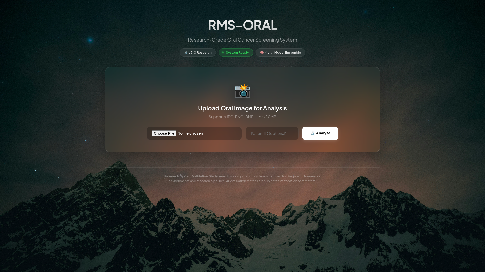
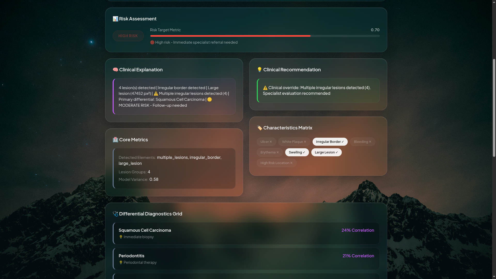
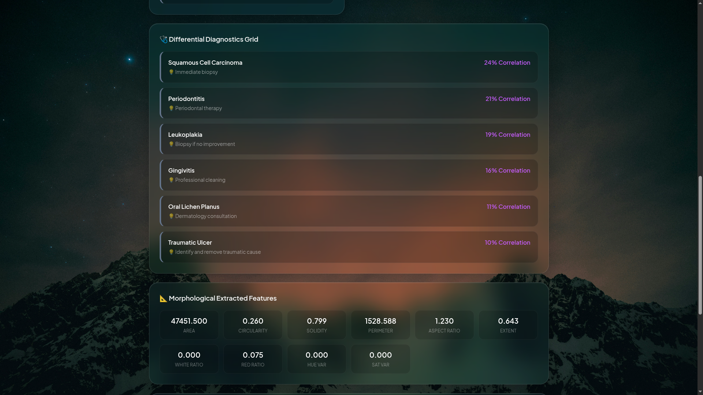

# 🦷 RMS-ORAL: Research-Grade Oral Cancer Screening System

<div align="center">


**A Multimodal AI System for Oral Lesion Detection and Clinical Decision Support**

[Features](#-features) • [Installation](#-installation) • [Usage](#-usage) • [Architecture](#-architecture) • [API](#-api) • [Contributors](#-contributors)

</div>


<div align="center">

<table>
  <tr>
    <td></td>
    <td></td>
  </tr>
  <tr>
    <td></td>
    <td></td>
  </tr>
</table>

</div>

---

## 📋 Table of Contents

- [Overview](#-overview)
- [Features](#-features)
- [System Architecture](#-system-architecture)
- [Installation](#-installation)
- [Usage](#-usage)
- [API Endpoints](#-api-endpoints)
- [Model Details](#-model-details)
- [Clinical Decision Engine](#-clinical-decision-engine)
- [Contributors](#-contributors)
- [License](#-license)

---

## 🎯 Overview

**RMS-ORAL** (Research-grade Multimodal System for Oral Lesion Assessment) is an advanced AI-powered clinical decision support system designed for oral cancer screening and lesion detection. It combines state-of-the-art computer vision models with a sophisticated clinical decision engine to provide accurate, explainable, and clinically meaningful assessments.

### Key Differentiators

- **Clinical-First Approach**: Not just an AI pipeline, but a real clinical decision system
- **Multi-Model Ensemble**: Combines YOLO, MedSAM, BioMedCLIP, and Clinical ViT
- **Feature-Based Risk Engine**: Risk calculated from clinical features, not just model output
- **Clinical Override System**: Safety-first logic that overrides model predictions when necessary
- **Explainable AI**: Every decision comes with a human-readable explanation
- **Production Ready**: Modular architecture with proper error handling

---

## ✨ Features

### 🔬 Core Capabilities

| Feature | Description |
|---------|-------------|
| **Image Quality Assessment** | Checks resolution, brightness, contrast, blur, and aspect ratio |
| **OOD Detection** | Identifies out-of-distribution images (non-oral images) |
| **Lesion Detection** | YOLO-based detection with MedSAM fallback for segmentation |
| **Feature Extraction** | Geometric features (area, circularity, solidity) and color features (white ratio, red ratio) |
| **Semantic Analysis** | BioMedCLIP + Clinical ViT ensemble for pathology classification |
| **Multi-Label Classification** | Identifies ulcer, white plaque, irregular border, bleeding, erythema, swelling |
| **Clinical Risk Engine** | Feature-based risk calculation with weighted components |
| **Clinical Override** | Safety-first logic that overrides model predictions |
| **Differential Diagnosis** | Probabilistic differential diagnosis with confidence scores |
| **Guideline Engine** | WHO and clinical guideline evaluation |
| **Lesion Tracking** | Track changes in lesions over time per patient |
| **Explainable AI** | Human-readable explanations for all decisions |
| **Clinical Reports** | HTML and PDF report generation |

### 🧠 Clinical Decision Layer

The system uses a **Feature-Based Risk Engine** with the following components:

```
Risk Score = 
    0.30 × Lesion Presence +
    0.25 × Irregular Border +
    0.20 × White Plaque +
    0.15 × Ulceration +
    0.10 × Large Size +
    0.10 × High Risk Location
```

**Clinical Override Rules** (Safety First):
- If lesion detected but model says "healthy" → Override to "SUSPICIOUS"
- If multiple irregular lesions → Override to "HIGH RISK"
- If large white plaque with suspicious features → Override to "HIGH RISK"

---

## 🏗️ System Architecture

```
┌─────────────────────────────────────────────────────────────────┐
│                       INPUT (Image)                             │
└─────────────────────────────────────────────────────────────────┘
                                │
                                ▼
┌─────────────────────────────────────────────────────────────────┐
│                   1. IMAGE QUALITY ASSESSMENT                   │
│  • Resolution • Brightness • Contrast • Blur • Aspect Ratio    │
└─────────────────────────────────────────────────────────────────┘
                                │
                                ▼
┌─────────────────────────────────────────────────────────────────┐
│                      2. SAFETY CHECK (OOD)                      │
│  • Is it a mouth image? • Valid content?                       │
└─────────────────────────────────────────────────────────────────┘
                                │
                                ▼
┌─────────────────────────────────────────────────────────────────┐
│                   3. SEGMENTATION (YOLO + MedSAM)               │
│  • Lesion detection • Mask generation                          │
└─────────────────────────────────────────────────────────────────┘
                                │
                                ▼
┌─────────────────────────────────────────────────────────────────┐
│                   4. FEATURE EXTRACTION                         │
│  • Area • Perimeter • Circularity • Solidity                   │
│  • White Ratio • Red Ratio • Aspect Ratio                      │
└─────────────────────────────────────────────────────────────────┘
                                │
                                ▼
┌─────────────────────────────────────────────────────────────────┐
│                   5. SEMANTIC ANALYSIS                          │
│  • BioMedCLIP • Clinical ViT • Ensemble                        │
└─────────────────────────────────────────────────────────────────┘
                                │
                                ▼
┌─────────────────────────────────────────────────────────────────┐
│                   6. CLINICAL OVERRIDE                          │
│  • If lesion detected but model says healthy → OVERRIDE        │
│  • Multiple irregular lesions → OVERRIDE                       │
└─────────────────────────────────────────────────────────────────┘
                                │
                                ▼
┌─────────────────────────────────────────────────────────────────┐
│                   7. RISK ENGINE (Feature-Based)                │
│  • Lesion count • Irregular border • White plaque              │
│  • Size • Semantic confidence • Clinical override              │
└─────────────────────────────────────────────────────────────────┘
                                │
                                ▼
┌─────────────────────────────────────────────────────────────────┐
│                   8. DIFFERENTIAL DIAGNOSIS                     │
│  • Leukoplakia • Lichen Planus • Traumatic Ulcer • SCC         │
└─────────────────────────────────────────────────────────────────┘
                                │
                                ▼
┌─────────────────────────────────────────────────────────────────┐
│                   9. GUIDELINE ENGINE                           │
│  • WHO guidelines • Clinical rules • Safety rules              │
└─────────────────────────────────────────────────────────────────┘
                                │
                                ▼
┌─────────────────────────────────────────────────────────────────┐
│                   10. CLINICAL RECOMMENDATION                   │
│  • Urgent referral • Biopsy • Monitor • Routine check-up       │
└─────────────────────────────────────────────────────────────────┘
                                │
                                ▼
┌─────────────────────────────────────────────────────────────────┐
│                       OUTPUT (Report)                           │
│  • Risk Score • Lesions • Differential • Recommendation        │
│  • Explanation • Uncertainty • Tracking                         │
└─────────────────────────────────────────────────────────────────┘
```

---

## 📦 Installation

### Prerequisites

- Python 3.10 or higher
- 8GB+ RAM (16GB recommended)
- CPU or GPU (CUDA compatible GPU recommended for production)

### Step 1: Clone the Repository

```bash
git clone https://github.com/KooshaYeganeh/RMS-ORAL.git
cd RMS-ORAL
```

### Step 2: Create Virtual Environment

```bash
python -m venv venv
source venv/bin/activate  # On Windows: venv\Scripts\activate
```

### Step 3: Install Dependencies

```bash
pip install --upgrade pip
pip install -r requirements.txt
```

### Step 4: Download Models

```bash
# Download YOLO model
wget https://github.com/ultralytics/assets/releases/download/v0.0.0/yolov8n.pt -O best.pt

# Or use a larger model for better accuracy
wget https://github.com/ultralytics/assets/releases/download/v0.0.0/yolov8m.pt -O best.pt
```

### Step 5: Download MedSAM (Optional - for advanced segmentation)

```bash
# MedSAM requires ~2GB download
python -c "from huggingface_hub import hf_hub_download; hf_hub_download('kooshakooshadv/medsam-vit-b', 'medsam_vit_b.pth', local_dir='models/medsam/')"
```

### Step 6: Run the Application

```bash
python app.py
```

---

## 🚀 Usage

### Web Interface

1. Open your browser and navigate to `http://localhost:5005`
2. Upload an oral image (JPG, PNG, BMP)
3. Enter Patient ID (optional)
4. Click "Analyze"
5. View comprehensive results including:
   - Risk assessment
   - Lesion detection
   - Clinical explanation
   - Differential diagnosis
   - Clinical recommendations
   - Tracking history

### API Usage

#### Health Check
```bash
curl http://localhost:500۵/api/health
```

#### Predict
```bash
curl -X POST -F "image=@sample.jpg" -F "patient_id=12345" http://localhost:5005/api/predict
```

#### Get Patient Tracking
```bash
curl http://localhost:5005/api/track/12345
```

---

## 📡 API Endpoints

| Endpoint | Method | Description |
|----------|--------|-------------|
| `/` | GET/POST | Web interface |
| `/api/predict` | POST | Image analysis |
| `/api/health` | GET | System health check |
| `/api/track/<patient_id>` | GET | Patient tracking history |

### API Response Example

```json
{
  "success": true,
  "risk_score": 0.65,
  "risk_level": "medium",
  "risk_message": "🟡 Moderate risk - Schedule evaluation within 1 month",
  "lesion_count": 2,
  "clinical_terms": ["irregular_border", "white_plaque"],
  "recommendation": "🟡 Schedule dental evaluation within 1 month",
  "explanation": "2 lesion(s) detected | Irregular border detected | White plaque present | Primary differential: Leukoplakia | 🟡 MODERATE RISK - Follow-up needed",
  "uncertainty": 0.32,
  "differential": [
    {"condition": "Leukoplakia", "score": 0.45},
    {"condition": "Oral Lichen Planus", "score": 0.30}
  ],
  "guidelines": [
    {"action": "biopsy", "message": "Large white plaque (>100 px²) - biopsy recommended", "severity": "high"}
  ],
  "multi_labels": {
    "white_plaque": true,
    "irregular_border": true,
    "ulcer": false
  }
}
```

---

## 🧠 Model Details

### YOLO (Object Detection)
- **Purpose**: Primary lesion detection
- **Model**: YOLOv8 (nano or medium)
- **Input**: 640x640 RGB image
- **Output**: Bounding boxes with confidence scores

### MedSAM (Segmentation)
- **Purpose**: Advanced lesion segmentation
- **Model**: MedSAM (Medical SAM)
- **Input**: 1024x1024 RGB image
- **Output**: Segmentation masks

### BioMedCLIP (Semantic)
- **Purpose**: Medical image-text understanding
- **Model**: BioMedCLIP ViT-B-32
- **Input**: 224x224 RGB image
- **Output**: 6-class probability distribution

### Clinical ViT (Semantic)
- **Purpose**: Oral pathology classification
- **Model**: Fine-tuned ViT
- **Input**: 224x224 RGB image
- **Output**: 2-class or 6-class probability distribution

---

## 🩺 Clinical Decision Engine

### Risk Components

| Component | Weight | Description |
|-----------|--------|-------------|
| Lesion Presence | 30% | Any lesion detected |
| Irregular Border | 25% | Circularity < 0.5 |
| White Plaque | 20% | White ratio > 0.3 |
| Ulceration | 15% | Ulcer detected |
| Large Size | 10% | Area > 100 px² |
| High Risk Location | 10% | Tongue bottom, floor mouth, soft palate |

### Risk Levels

| Level | Score Range | Action |
|-------|-------------|--------|
| 🟢 Low | < 0.4 | Routine dental check-up |
| 🟡 Medium | 0.4 - 0.7 | Schedule evaluation within 1 month |
| 🔴 High | > 0.7 | Immediate specialist referral |

### Differential Diagnoses

| Condition | Key Features | Risk |
|-----------|--------------|------|
| Squamous Cell Carcinoma | Ulcer + Irregular border + Bleeding | 0.8 |
| Leukoplakia | White plaque + Irregular border | 0.3 |
| Oral Lichen Planus | White plaque + Erythema + Ulcer | 0.2 |
| Traumatic Ulcer | Ulcer + Bleeding | 0.1 |

### Clinical Guidelines

| Rule | Action | Severity |
|------|--------|----------|
| Ulcer > 14 days | Urgent referral | High |
| Large white plaque (>100 px²) | Biopsy | High |
| Irregular border + Bleeding | High risk | High |
| Medium lesion > 7 days | Monitor | Medium |

---

## 📁 Project Structure

```
RMS-ORAL/
├── app.py                      # Flask application
├── config.py                   # Configuration settings
├── requirements.txt            # Python dependencies
├── best.pt                     # YOLO model weights
├── models/
│   ├── __init__.py
│   ├── segmenter.py           # MedSAM + YOLO
│   ├── semantic.py            # BioMedCLIP + ViT
│   └── features.py            # Feature extraction
├── clinical/
│   ├── __init__.py
│   ├── decision_engine.py     # Core decision logic
│   ├── risk_engine.py         # Feature-based risk
│   ├── differential.py        # Differential diagnosis
│   ├── guidelines.py          # Clinical guidelines
│   ├── safety.py              # OOD + Safety
│   └── calibration.py         # Model calibration
├── utils/
│   ├── __init__.py
│   ├── image_quality.py       # Quality assessment
│   └── report.py              # Report generation
└── templates/
    └── index.html             # Web interface
```

---

## 🔧 Configuration

Edit `config.py` to customize:

```python
# Clinical thresholds
RISK_THRESHOLD_HIGH = 0.7
RISK_THRESHOLD_MEDIUM = 0.4

# Feature weights
FEATURE_WEIGHTS = {
    'lesion_presence': 0.30,
    'irregular_border': 0.25,
    'white_plaque': 0.20,
    'ulceration': 0.15,
    'size_large': 0.10,
    'high_risk_location': 0.10,
}

# High risk locations
HIGH_RISK_LOCATIONS = ['tongue_bottom', 'floor_mouth', 'soft_palate']
```

---

## 🧪 Testing

### Test Single Image

```python
from clinical.decision_engine import ClinicalDecisionEngine
from PIL import Image

engine = ClinicalDecisionEngine()
image = Image.open("test.jpg")
result = engine.analyze(image, patient_id="test_patient")
print(result['risk_score'], result['risk_level'])
```

### Test API

```bash
# Run tests
python -m pytest tests/

# Test with curl
curl -X POST -F "image=@sample.jpg" http://localhost:5005/api/predict
```

---

## 📊 Performance Considerations

### CPU Mode (i5-8250U)

| Component | Time |
|-----------|------|
| YOLO Detection | 2-5 seconds |
| BioMedCLIP | 1-2 seconds |
| Clinical ViT | 1-2 seconds |
| Feature Extraction | <1 second |
| **Total** | **5-10 seconds** |

### GPU Mode (CUDA)

| Component | Time |
|-----------|------|
| YOLO Detection | <1 second |
| BioMedCLIP | <0.5 second |
| Clinical ViT | <0.5 second |
| Feature Extraction | <0.1 second |
| **Total** | **1-2 seconds** |

---

## 🤝 Contributors

### Developer & Maintainer

**Koosha Yeganeh**
- Email: kooshakooshadv@gmail.com
- GitHub: [@KooshaYeganeh](https://github.com/KooshaYeganeh)
- Role: Devops

### Dental Consultant

**Dr. Katayoun Katebi**
- Role: Clinical Consultant
- Expertise: Oral and maxillofacial diseases, oral cancer screening, clinical validation

### Acknowledgments

- BioMedCLIP team for the medical vision-language model
- Ultralytics for YOLO
- Meta AI for SAM/MedSAM
- HuggingFace for model hosting

---

## 📄 License

This project is licensed under the MIT License - see the [LICENSE](LICENSE) file for details.

---

## ⚠️ Disclaimer

```
⚠️ RESEARCH PROTOTYPE - NOT FOR CLINICAL DIAGNOSIS

This system is a research prototype and should NOT be used for:
- Clinical diagnosis without professional medical review
- Treatment decisions
- Replacing professional medical judgment

Always consult with a qualified healthcare professional for diagnosis and treatment.
```

---

## 📞 Support

- **website**: [GitHub Issues](https://kooshayeganeh.github.io)
- **Email**: kooshakooshadv@gmail.com
- **Documentation**: [Wiki](https://github.com/KooshaYeganeh/RMS-ORAL/wiki)

---

## 🔄 Changelog

### v3.0.0 (Current)
- Complete clinical decision engine
- Feature-based risk calculation
- Clinical override system
- Multi-model ensemble
- Differential diagnosis
- Clinical guidelines
- Lesion tracking
- Professional HTML reports

### v2.0.0
- Added MedSAM segmentation
- BioMedCLIP integration
- Uncertainty quantification

### v1.0.0
- Initial release with YOLO + ViT
- Basic risk assessment

---

<div align="center">

**Built with ❤️ for Research and Clinical Decision Support**

[Report Bug](https://github.com/KooshaYeganeh/RMS-ORAL/issues) • [Request Feature](https://github.com/KooshaYeganeh/RMS-ORAL/issues)

</div>
```

---

## 📄 `requirements.txt`

```txt
# Core
flask==2.3.3
torch==2.0.1
torchvision==0.15.2
numpy==1.24.3
Pillow==10.0.0

# Computer Vision
opencv-python==4.8.0.74
ultralytics==8.0.196
segment-anything==1.0

# Transformers & CLIP
transformers==4.31.0
open-clip-torch==2.20.0
huggingface-hub==0.16.4

# Machine Learning
scikit-learn==1.3.0

# Reporting
reportlab==4.0.4
matplotlib==3.7.2
seaborn==0.12.2

# Utilities
tqdm==4.65.0
requests==2.31.0
```


