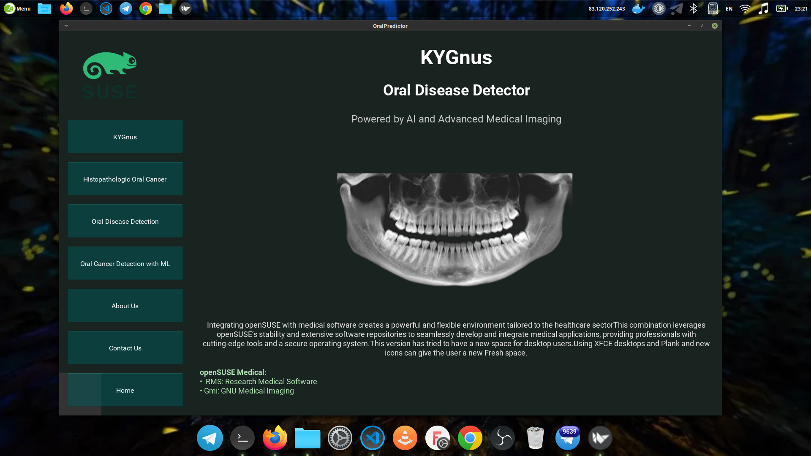

# rms-oral

This application is designed to assist with the diagnosis of oral and dental diseases using advanced AI and deep learning techniques. Leveraging powerful frameworks like PyTorch and MONAI, the system is capable of analyzing oral disease images and providing accurate predictions to assist healthcare professionals in early diagnosis and treatment.


### Version 1



### Version 2


## Table of Contents
- [Features](#features)
- [Technology Stack](#technology-stack)
- [Installation](#installation)
- [Usage](#usage)
- [Building Executables](#building-executables)
- [Deep Learning & AI in Dental Healthcare](#deep-learning--ai-in-dental-healthcare)
- [License](#license)
- [Contributing](#contributing)

## Features
- **User-friendly Interface**: Easy navigation and interaction with the app.
- **Image Upload**: Allows users to upload oral disease images for analysis.
- **Real-Time Prediction**: Provides accurate predictions of oral diseases using advanced deep learning models.
- **Integration with MONAI**: The Medical Open Network for AI (MONAI) is utilized for deep learning workflows in the healthcare domain.
- **Cross-Platform Support**: Runs on Linux, Windows, and macOS.

## Technology Stack
- **UI Framework**: Kivy (for cross-platform graphical user interface) for First Version and Web GUI for second Version
- **Deep Learning Frameworks**: PyTorch & MONAI (for medical imaging and AI models)
- **Image Processing**: Pillow (for image handling) and Scikit-Image
- **Packaging**: PyInstaller (for creating standalone executables)


- **Note1 : The data used in the machine learning section is sample Not REAL Data**
- **Note2 : Latest trained Data at : Mon 21 Oct 2024 08:24:36 PM**
- **Note3 : The software is currently under development**
- **Number of oral Cancer Data : 150 -> Train with Scikit-learn**
- **Number of Histopathologic Oral Cancer Data : 5192 -> Train with Monai**

## Providing a development environment 

### Prerequisites
Ensure you have the following installed on your system:
- Python 3.11
- Git (optional, for cloning the repository)
- Virtualenv (recommended for isolating dependencies)

### Steps to Install and Run Locally

1. **Clone the repository**:
   ```bash
   git clone https://github.com/KooshaYeganeh/ood.git
   cd ood-main
   ```

2. **Set up a virtual environment (optional but recommended)**:
   ```bash
   python -m venv venv
   source venv/bin/activate  # On Windows: venv\Scripts\activate
   ```

3. **Install dependencies**:
   ```bash
   pip install -r requirements.txt
   ```

4. **Run the application**:
   ```bash
   python rms-oral.py
   ```

### Additional Dependencies

Ensure you have the following Python libraries installed:

- **Kivy**: For building the UI For First Version.
- **Kivy**: Flask and Bootstrap web GUI for Second Version.
- **Pillow**: For image handling and processing.
- **PyTorch**: For deep learning model development and predictions.
- **MONAI**: For advanced AI workflows in medical image processing and deep learning.

To install these dependencies, run:

```bash
pip install kivy pillow torch monai
```

### Installing PyInstaller

If you want to build a standalone executable, install `pyinstaller`:

```bash
pip install pyinstaller
```


## Usage

1. **Run the App**:
   After installing, you can run the application with:
   ```bash
   python rms-oral.py
   ```

2. **Upload Images**:
   Use the upload button in the app to select oral disease images for analysis.

3. **Get Predictions**:
   After uploading an image, the app processes it using the trained CNN and MONAI models and provides predictions on the type of disease.

## Building Executables

To build a standalone executable for distribution:

1. **Install PyInstaller**:
   Make sure `pyinstaller` is installed:
   ```bash
   pip install pyinstaller
   ```

2-1. **Create the Executable File for Linux**:
   Run the following command to package the application:
   ```bash
   pyinstaller --onefile --windowed app/Desktop.py
   ```

2-2. **Create Executable For MSwindows**

   ```
   pyinstaller app.py --onefile --add-data "templates;templates" --add-data "static;static" --icon=icon.ico -n webvieworal.exe --hidden-import=sklearn.ensemble._forest --hidden-import=sklearn.tree._tree --hidden-import=joblib --hidden-import=sklearn.impute
   ```

   This will generate a standalone executable in the `dist` folder that can be distributed to users without requiring Python or additional dependencies.


2-3. **Create Executable For Linux**

```
pyinstaller --onefile --add-data "templates:templates" --add-data "static:static" --noconsole --hidden-import "sklearn.impute" --hidden-import "joblib" --hidden-import "sklearn.tree._tree" --hidden-import "sklearn.ensemble._forest" --hidden-import "sklearn.ensemble" -n rms-oral-linux app.py

```


3. **Distribute the Executable**:
   Share the executable generated in the `dist` folder. Users can run the application without needing to install Python or other dependencies.


**Application Running on 127.0.0.1:5005**


## Deep Learning & AI in Dental Healthcare

Artificial Intelligence (AI) is revolutionizing the healthcare industry, and dental care is no exception. With advances in **deep learning** and **medical imaging technologies** like **MONAI**, AI systems can now assist dentists in diagnosing complex oral diseases with high accuracy.

### Why Use AI in Dental Healthcare?
- **Early Detection**: AI can assist in detecting diseases at an early stage, which is crucial for successful treatment outcomes.
- **Accuracy**: Deep learning models, particularly Convolutional Neural Networks (CNNs), can analyze intricate patterns in oral disease images, surpassing human capabilities in many cases.
- **Efficiency**: AI tools provide instant analysis, saving valuable time for dental professionals.
  
### MONAI in Medical Imaging
MONAI (Medical Open Network for AI) is a specialized open-source framework for deep learning in healthcare. It integrates with PyTorch and provides optimized tools for training AI models on medical images, such as X-rays and dental scans. This project uses MONAI to improve the accuracy and robustness of oral disease predictions.


By combining CNN-based models with MONAI’s medical-specific deep learning tools, this app provides state-of-the-art predictions for various oral diseases. 

## License
This project is licensed under the MIT License. See the [LICENSE](LICENSE) file for details.

## Contributers

**Dr Katayoun Katebi - Oral and Maxillofacial Medicine** : Consultant & Contributer(Domain Expert)
**Professor Soodabeh Kimyai - Oral and Maxillofacial Medicine** : Consultant & Contributer(Restorative and aesthetic medicine Domain Expert)


### Steps to Contribute:
1. Fork the repository.
2. Create a new feature branch: `git checkout -b feature/my-feature`.
3. Commit your changes: `git commit -m 'Add some feature'`.
4. Push to the branch: `git push origin feature/my-feature`.
5. Open a pull request.


### Notes :

- The data related to machine learning is in the form of a sample, and if you want to use this software in a stable way, put your csv file and train it.
- The data related to Oral Disease Detection is very limited and cannot be guaranteed. Therefore, if needed, you can replace your data (The data will be updated regularly and the train file will be updated)
- Histopathologic Oral Cancer Detection data were taken from kaggle site.


